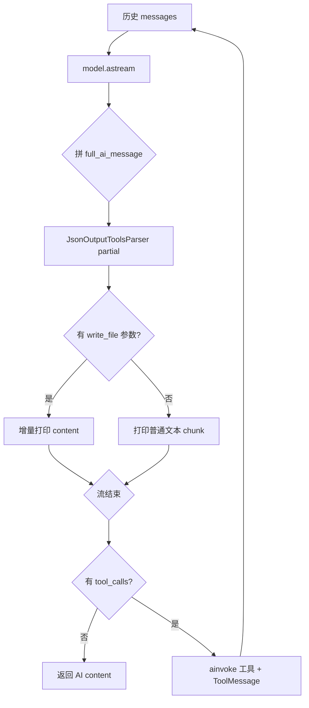

# mini_cursor.py 说明

对应 JS：`output-parser-test/src/test/mini-cursor.mjs`。

手工实现 **Agent 循环**：流式输出 + `JsonOutputToolsParser` 增量解析 + `write_file` 内容流式预览。工具定义见同目录 [`all_tool.py`](./all_tool.py)（参数为 `file_path`、`working_directory` 等 snake_case）。

---

## 运行

```bash
cd output-parser-test-python/src/test && uv run python mini_cursor.py
```

需配置 `.env`：`OPENAI_API_KEY`、`OPENAI_BASE_URL`，可选 `MODEL_NAME`（默认 `qwen-plus`）。

### 更短：仅 astream + 增量解析

[`mini_cursor_astream_parser_simple.py`](./mini_cursor_astream_parser_simple.py)：**只有** `astream`（`messages` / `updates` / `values`），保留 **`JsonOutputToolsParser(partial=True)`** 与 **`write_file` content 流式预览**；无 `astream_events`、无冗长 `updates` 打印。默认 `QUERY` 很短，大任务可换成 `mini_cursor_create_agent.py` 里的 `CASE1`。

### 简便版：`create_agent` + 流式（另一套脚本）

[`mini_cursor_create_agent.py`](./mini_cursor_create_agent.py) 使用 **`create_agent`**，不再手写多轮循环：

- **`astream`**：`stream_mode=["messages", "updates", "values"]`（模型流式输出 + 节点增量 + 最终 state）
- **`astream_events`**：`version="v2"`，筛选 `on_chat_model_stream` / `on_tool_start` / `on_tool_end` 等

```bash
uv run python mini_cursor_create_agent.py           # 默认 astream
uv run python mini_cursor_create_agent.py events     # 仅 astream_events
uv run python mini_cursor_create_agent.py both       # 两种各跑一遍（约双倍消耗）
```

**`write_file` 流式预览**：`mini_cursor_create_agent.py` 的 **`run_with_astream`** 已在 `messages` 流上叠加 **`JsonOutputToolsParser(partial=True)`**，并在 `updates` 出现 **`ToolMessage`** 时重置累积，效果上可对齐 `mini_cursor.py`。**`astream_events`** 这一路仍主要打印 `content`，未做工具参数增量预览。

---

## 整体流程（一句话）

每一轮：把当前对话交给模型 → **流式**收回复并拼成一条完整 `AIMessage` → 流式过程中用 **partial** 解析判断是否在为 **`write_file`** 生成参数，是则 **边生成边打印 `content`** → 流结束后若存在 **`tool_calls`** 则 **`ainvoke`** 执行工具并把 **`ToolMessage`** 写入历史，进入下一轮；若无 **`tool_calls`** 则视为最终回复并结束。



---

## 依赖与初始化

| 行号（约） | 作用 |
|-----------|------|
| 7–12 | `asyncio` / `json` / `os` / `sys` |
| 14–19 | LangChain：历史、消息类型、`JsonOutputToolsParser`、`ChatGeneration`、`ChatOpenAI` |
| 21–26 | 从 `all_tool` 导入四个工具 |
| 28 | `load_dotenv()` |
| 30–35 | 构造 `ChatOpenAI`（模型名、key、base_url、`temperature=0`） |
| 37–38 | `bind_tools(tools)`，让模型能发 tool_calls |

---

## `_write_file_args(tool_call)`

从解析器得到的**单个**工具调用字典里取出：

- 路径：`args.file_path` 或 `args.filePath`（兼容驼峰）
- 内容：`args.content`（转 `str`）

返回 `(path, content)`，供流式预览使用。

---

## `run_agent_with_tools(query, max_iterations=30)`

### 初始化对话

1. **`InMemoryChatMessageHistory()`**：内存中的消息列表。
2. **`SystemMessage`**：角色、当前 `os.getcwd()`、四个工具说明、`execute_command` / `write_file` 的规则（与 mjs 一致，参数名为 Python 风格）。
3. **`HumanMessage(content=query)`**：用户任务（如 `CASE1`）。

### 外层循环（最多 30 轮）

每一轮：

1. **`history.aget_messages()`** → 作为 **`astream(messages)`** 的输入。
2. **`full_ai_message = None`**，**`printed_lengths: dict`** 记录每个 `write_file` 已打印字符数。
3. **`async for chunk in stream`**  
   - **`full_ai_message = full_ai_message + chunk`**（与 JS `concat` 等价）。  
   - **`tool_parser.parse_result([ChatGeneration(message=full_ai_message)], partial=True)`**  
     - 必须用 **`ChatGeneration`** 包装。  
     - **`partial=True`**：JSON 未完整时也尝试解析（流式必需）；失败则 `except` 忽略。  
   - 若解析出列表且含 **`type == "write_file"`**：按 **`tool_id`** 只打印 **`content` 新增后缀**（`content[prev:]`）。  
   - 否则：若有 **`chunk.content`**，字符串直接写终端，否则 **`json.dumps`**。
4. 流结束后 **`history.add_message(full_ai_message)`**。
5. 若 **`tool_calls` 为空**：打印最终 content 并 **`return`**。  
6. 否则对每个 tool call：**`await tool.ainvoke(args)`**，再 **`ToolMessage(content=..., tool_call_id=...)`** 加入历史（id 必须与模型调用一致）。

若 30 轮内未 return，返回最后一条消息的 `content`（兜底）。

---

## 与 `JsonOutputToolsParser` 的要点

- 解析的是 **OpenAI 风格** 的 tool_calls（在流式过程中常出现在 **`additional_kwargs`**，拼完后可能有正式的 **`message.tool_calls`**）。
- **`partial=True`**：允许「半个 JSON」阶段也解析出部分字段（例如 `write_file` 的 `content` 越来越长）。
- 解析结果里工具名在 **`type`** 字段（内部由 **`name`** 改名而来），与 mjs 里 `toolCall.type === 'write_file'` 一致。

---

## `CASE1` 与入口

- **`CASE1`**：脚本内置的大段任务说明（Vite + React Todo + pnpm 等），与 `mini-cursor.mjs` 中一致。
- **`if __name__ == "__main__"`**：**`asyncio.run(_main())`**，异常时打印到 stderr 并 **`raise`**。

---

## 相关文件

| 文件 | 说明 |
|------|------|
| `mini_cursor.py` | 本说明对应的 Python 实现 |
| `all_tool.py` | `read_file` / `write_file` / `execute_command` / `list_directory` |
| `../mini-cursor.mjs`（output-parser-test） | JS 参考实现 |

---

## 常见问题

**Q：`aadd_messages` 传单个 message 可以吗？**  
A：`aadd_messages` 需要**消息序列**。本脚本使用 **`history.add_message(...)`** 单条添加，避免类型错误。

**Q：为什么工具参数有时是 `filePath` 有时是 `file_path`？**  
A：网关/模型可能返回驼峰；Python 工具定义为 snake_case。`_write_file_args` 两种都读。

**Q：流式阶段 `parsed_tools` 一直为空？**  
A：检查是否传了 **`ChatGeneration`** 和 **`partial=True`**；不同厂商流式字段可能差异，需对照实际 `chunk` 调试。
